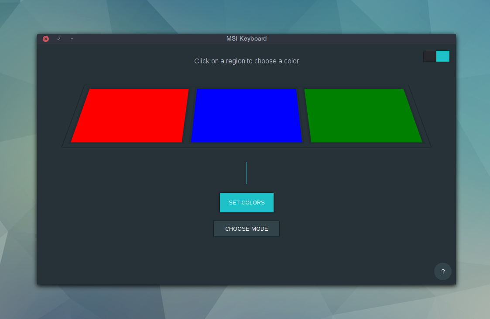

# msi-keyboard-gui

> The First fully featured GUI MSI Keyboard controller for Linux




## Install

From development:

- Install the required libraries for your OS: `libusb-dev` or `libusb-1.0-0-dev`
- Node.js version 6+ is required due to `node-hid` bindings

```
$ git clone https://github.com/stevelacy/msi-keyboard-gui
$ cd msi-keyboard-gui
$ npm install
$ sudo npm start

```

From prebuilt binaries:

Download the latest from the [releases](https://github.com/stevelacy/msi-keyboard-gui/releases)
```

$ unzip ./msi-keyboard-gui* -d ./msi-keyboard-gui
$ sudo ./msi-keyboard-gui/msi-keyboard-gui

```

## Usage

1. Click on a region to select a color
2. Choose a color
3. Click "Set Color" to activate the keyboard


## Modes

Click on "Set Mode" to choose a mode. The currently supported modes are:

  wave
  breathe
  normal

By default the normal mode is used to light all three regions of the keyboard.

#### Device support requested

If this project works on your system please send a commit adding your device description to [this list](SUPPORTED.md)

#### Contributions welcome!
If you find a bug or issue please check the [github issues](https://github.com/stevelacy/msi-keyboard-gui/issues) or open an new one.
Feature requests / pull requests are welcome!

## [License](LICENSE) (MIT)
