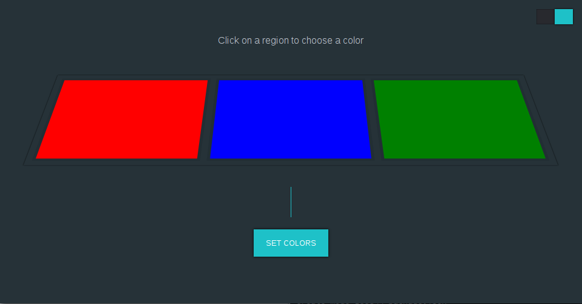

# msi-keyboard-gui

> The First fully featured GUI MSI Keyboard controller for Linux


## Install

```
$ git clone https://github.com/stevelacy/msi-keyboard-gui
$ cd msi-keyboard-gui
$ npm install
$ sudo npm start

## Usage

1. Click on a region to select a color
2. Choose a color
3. Click "Set Color" to activate the keyboard




##  (MIT)
